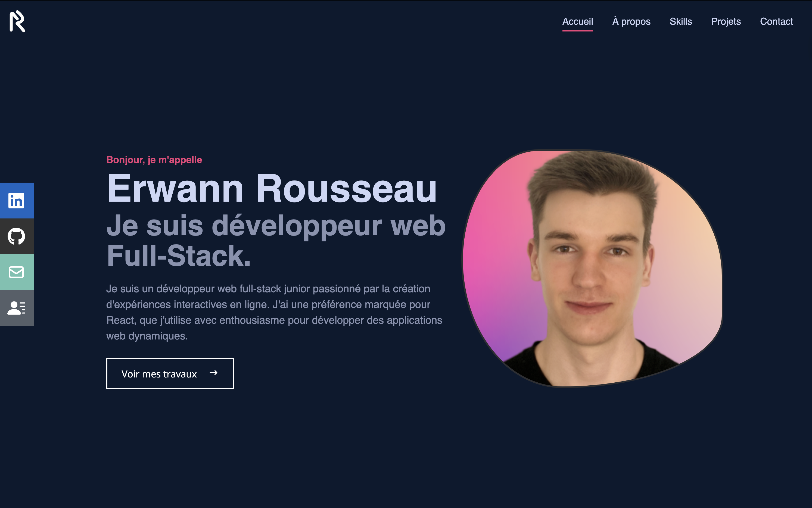

# Portfolio - Erwann Rousseau

Mon portfolio personnel, développé à l'aide de React, SCSS, Tailwind CSS, Framer Motion, et plus encore !



## Technologies utilisées

- [React](https://reactjs.org/): Une bibliothèque JavaScript pour la construction de l'interface utilisateur.
- [Vite](https://vitejs.dev/): Un outil de build moderne pour des temps de développement plus rapides.
- [Tailwind CSS](https://tailwindcss.com/): Un framework CSS utilitaire pour un design personnalisable rapidement.
- [SCSS](https://sass-lang.com/): Préprocesseur CSS pour des styles plus organisés et maintenables.
- [Framer Motion](https://www.framer.com/api/motion/): Une bibliothèque pour les animations fluides et performantes.
- [React Router Dom](https://reactrouter.com/): Bibliothèque de gestion des routes pour React.
- [React Scroll](https://www.npmjs.com/package/react-scroll): Module pour animer le défilement vers les composants.
- [React Icons](https://react-icons.github.io/react-icons/): Bibliothèque d'icônes pour React.
- [React Parallax Tilt](https://www.npmjs.com/package/react-parallax-tilt): Module pour créer des effets de parallaxe sur mes skills.
- [EmailJS](https://www.emailjs.com/): Permet d'envoyer des emails directement depuis JavaScript.

## Installation et utilisation

Vous aurez besoin de [Node.js](https://nodejs.org/) v12 ou plus récent. Suivez ces étapes pour l'installation :

1. Cloner le dépôt :

```bash
git clone git@github.com:ErwannRousseau/portfolio-react.git
cd portfolio-erwannrousseau
```

2. Installer les dépendances :

```bash
npm install
```

3. Démarrer le serveur de développement :

```bash
npm run dev
```

4. Pour créer une version de production de l'application, vous pouvez utiliser la commande suivante :

```bash
npm run build
```

5. Pour voir la version build, vous pouvez utiliser la commande suivant :

```bash
npm run preview
```
